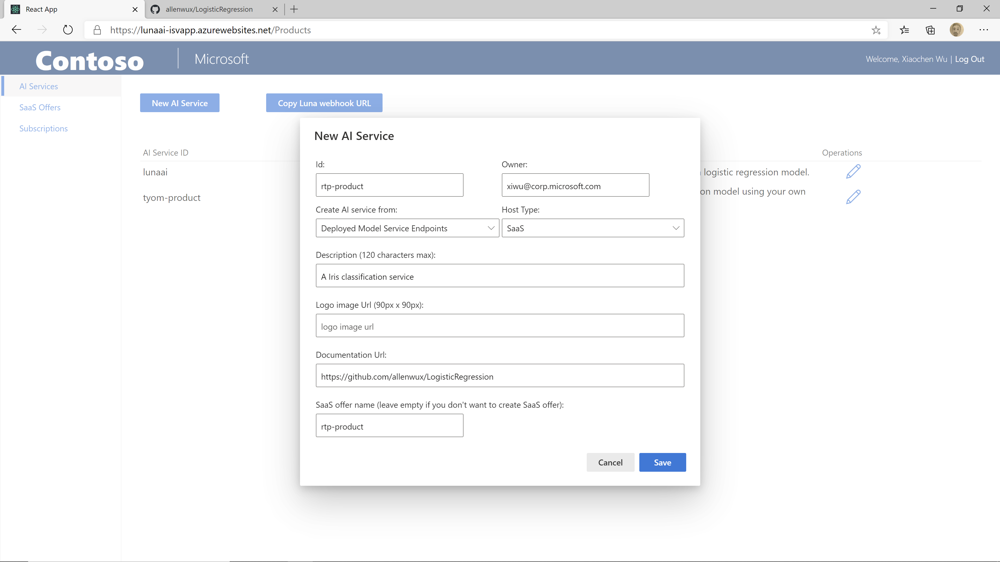
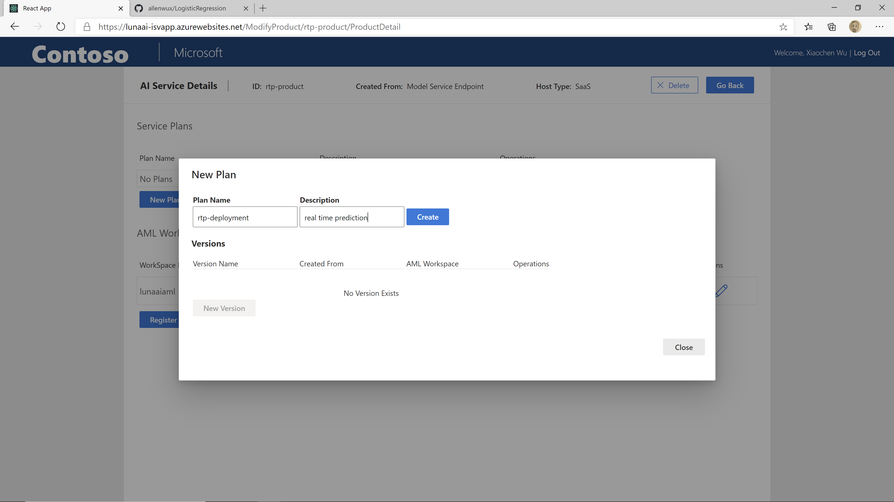
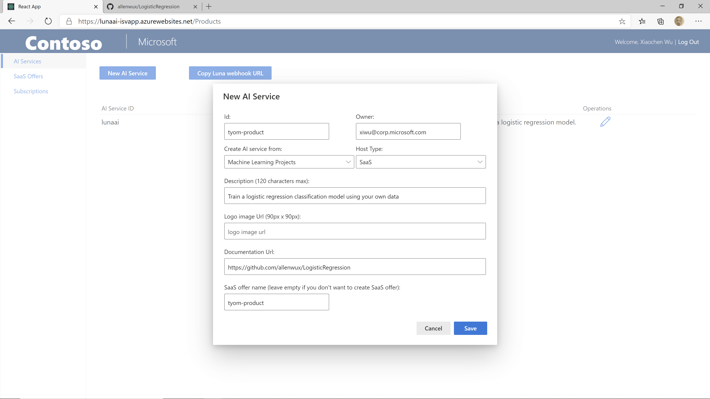
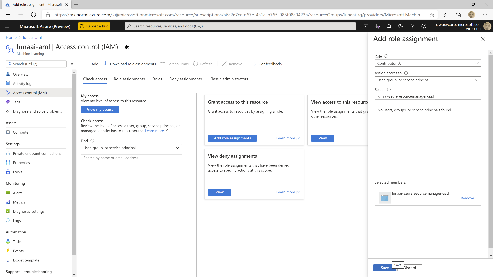

# Publish an AI service

In this article, we will show you how to publish an AI service using Luna management portal using the service endpoint and AML pipelines we published in the previous steps.

## Access Luna management portal

You can access the Luna management portal at https://*uniqueName*-isvapp.azurewebsites.net/ where *uniqueName* is the unique name you picked when you deploying Luna service. You will need to log in the portal using you AAD account. The AAD account must be added as the admin account during the deployment.

## Publish a real time prediction service

A real time prediction service allows the end user to call the endpoint API for real time scoring using a pre-trained model. In this example, we will use the Logistic Regression model we trained earlier using the Iris sample data.

You can skip this section if you are not planning to publish a real time prediction service.

### Create a real-time prediction product

You can create a new AI product by click on the "New AI Service" button on the "AI Services" tab. You will need to provide the following information:

- Id: the AI service id. In this example, we are going to use rtp-product
- Owner: it will be auto filled with your AAD user id. You can update it if you want other people to be the owner.
- Create AI service from: we are going to create the AI service from a "Deployed Model Service Endpoint" for real time prediction.
- Host Type: choose SaaS. "Selfhost" host type is not supported yet.
- Description: the description of your service
- Logo Url: a url to a 90 x 90 logo image. A default Azure Machine Learning logo will be used if not specified. In this tutorial, we will use the default logo
- Documentation url: url to the documentation page of your service. In this tutorial, you can point it to the Github repo you just created.
- SaaS offer name: A SaaS offer will be automatically created if the SaaS offer name is specified. For each plan created in this AI service, an corresponding plan with same name will also be created in the SaaS offer. In this tutorial, we use same name "rtp-product" for the SaaS offer.

Then click on "Save" button to save the changes.

### Create a real-time prediction plan

After the product is created, you will see two sections on the "AI Service Details" page: Service plans and AML Workspaces. For a real-time prediction AI service, you don't need to register an AML workspace yet. We will cover that in the next section when creating the train your own model service.

To create a new service plan, click on the "New Plan" button. You will need to provide the following information:

- Plan Name: the name of the plan. We are going to use *rtp-deployment* in this example.
- Description: the description of the plan, you can write your own description here

Then click on "Create" button to save the changes.

### Create a real-time prediction API version

In Luna AI service, we allow you to create multiple versions of APIs for a plan. To create a new API version, click on the "New Version" button.

In the "New Version" panel, provide the following information:
- Version Name: we will use "v1.0" in this tutorial
- Real time predict API: the service endpoint we deployed earlier. See [the previous step](./deploy-pre-trained-model.md#Test-the-scoring-endpoint) about how to get the endpoint
- Authentication: we will use key authentication in this tutorial
- Key: the authentication key. See [the previous step](./deploy-pre-trained-model.md#Test-the-scoring-endpoint) about how to get the key.

## Publish a train-your-own-model AI service

A train-your-own-model AI service allows the end user to call the APIs to train models using their own data, do batch inference with their own models and/or deploy the models to real time service endpoint for their online applications. The service will be created from a machine learning project using Luna ML project template.

You can skip this section if you are not planning to publish a train-your-own-model AI service.

### Create a train-your-own-model AI service

We are going to create a new AI service with name tyom-product for the train your own model AI service. In the "New AI Service" panel, provide the following information:
- Id: the AI service id. In this example, we are going to use tyom-product
- Owner: it will be auto filled with your AAD user id. You can update it if you want other people to be the owner.
- Create AI service from: we are going to create the AI service from a "Machine Learning Project".
- Host Type: choose SaaS. "Selfhost" host type is not supported yet.
- Description: the description of your service
- Logo Url: a url to a 90 x 90 logo image. A default Azure Machine Learning logo will be used if not specified. In this tutorial, we will use the default logo
- Documentation url: url to the documentation page of your service. In this tutorial, you can point it to the Github repo you just created.
- SaaS offer name: A SaaS offer will be automatically created if the SaaS offer name is specified. For each plan created in this AI service, an corresponding plan with same name will also be created in the SaaS offer. In this tutorial, we use same name "tyom-product" for the SaaS offer.

Then click on the "Save" button to save the changes.

### Register a Azure Machine Learning workspace

For an AI service created from Machine Learning Project, the operations including model training, batch inference and deployment are running in an Azure Machine Learning workspace as pipeline runs. To host the AI service, you need to provide the information about your Azure Machine Learning workspace and how to connect to it.

In Luna service, we use an AAD application to connect to the Azure Machine Learning service. In this example, we will reuse an AAD application we created when deploying Luna service.

First, in Azure portal type in "aad" in the search text box and click on "Azure Active Directory":

In the menu on the left side, choose "App registration". Click on "All application", type in *uniqueName*-azureresourcemanager-aad, and click on the item.

On the overview page of the AAD application, you can find the "Application (client) ID" and "Directory (tenant) ID". Write it down in the notepad

Then click on "Certificates & Secrets" in the menu on the left side. Under "Client Secrets", click on "New client secret". Write your own description and click on "Add". Copy and save the secret value before you leave the page.

Type in the name of you Azure Machine Learning service in the search window of Azure portal, find your Azure Machine Learning service and click on it.

Click on access control -> Add -> Add Role Assignment. In the popped up panel, choose "Contributor" as Role, in the "Select" textbox, type in *unique-name*-azureresourcemanage-aad. Select the service principal and click on Save.

To learn more about Azure role based access control, please see [Azure Role-based access control documentation](https://docs.microsoft.com/en-us/azure/role-based-access-control/role-assignments-portal)

Go back to the Luna management portal, click on the pencil button next to the AI service. Click on "Register New Workspace"

### Create a train-your-own-model deployment

You can create a new deployment in your product by click on the "New Deployment" button. Put in deployment name tyom-deployment, write your own description and click on "Create" button

### Create a train-your-own-model API version from published AML pipeline

After the deployment is created, you can create a new API version by click on the "New Version" button. In the popped up window, put in "v1.0" as version name. In the dropdown list of "Source", choose "Azure ML Pipelines". In the dropdown list of "AML Workspace", choose the workspace you just registered. It will load all the published pipelines in the workspace. Pick the corresponding pipelines for training, batch inference and deploy operations. Click on Save to save the changes.

### Create a train-your-own-model API version from Git repo

You can also create the API version directly from the Git repo. Create another new API version by click on the "New version" button. In the popped up window, put in "v2.0" as the version name. In the dropdown list of "Source", choose "Git repo". 

Go to the Github repo you created from the project template. Make sure you committed all the changes. Copy the Git HTTP URL and paste it to the "Git Url" textbox. 

For the "version", you can use your branch name (default is "main") to get the latest version from your branch or use the SHA for a specific commit

For personal access token, see [here](https://docs.github.com/en/enterprise/2.15/user/articles/creating-a-personal-access-token-for-the-command-line) about how to get the token from your GitHub account

In the AML Workspace dropdown list, select the workspace you just registered and click on Save to save the changes

## Save the Luna webhook URL

Going back to the home page of the "Products" tab, you will see a button "Copy Luna webhook URL". Clicking on the button, it will open a modal where 3 webhook URLs are shown. Later we will use these URLs to manage subscriptions of the AI services you just published in the SaaS offer. You may want to save the URLs in a notepad so you don't have to come back to this page later.

## Next Step

[Test AI service](./test-ai-service.md)
